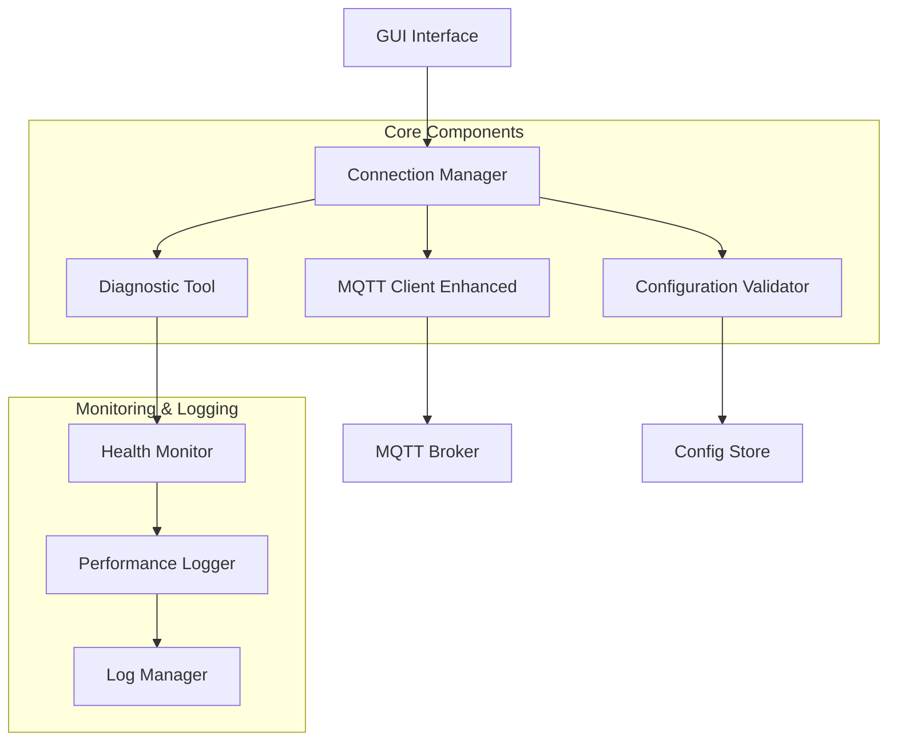
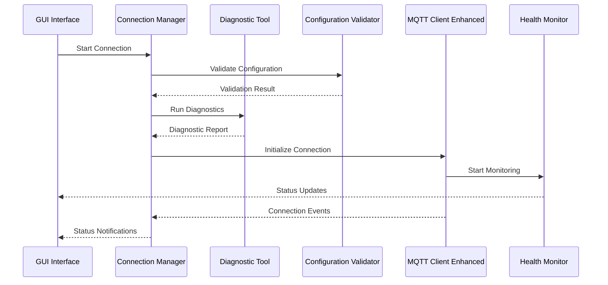

# MQTT连接可靠性改进设计文档

## 概述

本设计文档描述了改进MQTT摄像头监控系统连接可靠性的技术方案。系统将通过增强诊断、自动重连、配置验证、实时监控和日志记录功能来解决当前的MQTT连接问题，提高系统的稳定性和可维护性。

## 架构

### 整体架构



### 组件交互流程



## 组件和接口

### 1. Connection Manager (连接管理器)

**职责:**
- 管理MQTT连接生命周期
- 协调各组件间的交互
- 处理重连逻辑和故障恢复

**接口:**
```python
class ConnectionManager:
    def start_connection(self, config: MQTTConfig) -> ConnectionResult
    def stop_connection(self) -> bool
    def get_connection_status(self) -> ConnectionStatus
    def handle_connection_lost(self) -> None
    def apply_configuration_changes(self, config: MQTTConfig) -> bool
```

### 2. Diagnostic Tool (诊断工具)

**职责:**
- 执行连接诊断检查
- 生成诊断报告
- 提供问题解决建议

**接口:**
```python
class DiagnosticTool:
    def run_full_diagnostics(self, config: MQTTConfig) -> DiagnosticReport
    def test_network_connectivity(self, host: str, port: int) -> NetworkTest
    def validate_broker_availability(self, config: MQTTConfig) -> BrokerTest
    def generate_diagnostic_report(self) -> DiagnosticReport
```

### 3. Configuration Validator (配置验证器)

**职责:**
- 验证MQTT配置参数
- 检测配置冲突
- 提供配置修正建议

**接口:**
```python
class ConfigurationValidator:
    def validate_host_address(self, host: str) -> ValidationResult
    def validate_port_number(self, port: int) -> ValidationResult
    def validate_complete_config(self, config: MQTTConfig) -> ValidationResult
    def resolve_config_conflicts(self, gui_config: dict, file_config: dict) -> MQTTConfig
```

### 4. MQTT Client Enhanced (增强MQTT客户端)

**职责:**
- 处理MQTT连接和通信
- 实现智能重连机制
- 监控连接性能

**接口:**
```python
class MQTTClientEnhanced:
    def connect_with_retry(self, config: MQTTConfig) -> bool
    def disconnect_gracefully(self) -> None
    def publish_with_confirmation(self, topic: str, payload: str) -> PublishResult
    def get_connection_metrics(self) -> ConnectionMetrics
    def set_connection_callback(self, callback: Callable) -> None
```

### 5. Health Monitor (健康监控器)

**职责:**
- 实时监控连接状态
- 收集性能指标
- 检测异常情况

**接口:**
```python
class HealthMonitor:
    def start_monitoring(self) -> None
    def stop_monitoring(self) -> None
    def get_current_metrics(self) -> HealthMetrics
    def check_connection_quality(self) -> QualityReport
    def generate_performance_report(self) -> PerformanceReport
```

## 数据模型

### 配置模型
```python
@dataclass
class MQTTConfig:
    broker_host: str
    broker_port: int
    client_id: str
    subscribe_topic: str
    publish_topic: str
    keepalive: int
    max_reconnect_attempts: int
    reconnect_delay: int
    connection_timeout: int
    quality_of_service: int
```

### 诊断模型
```python
@dataclass
class DiagnosticReport:
    timestamp: datetime
    network_test: NetworkTest
    broker_test: BrokerTest
    config_validation: ValidationResult
    recommendations: List[str]
    overall_status: DiagnosticStatus
```

### 性能监控模型
```python
@dataclass
class ConnectionMetrics:
    connection_uptime: float
    message_success_rate: float
    average_latency: float
    reconnection_count: int
    last_error: Optional[str]
    quality_score: float
```

## 正确性属性

*属性是应该在系统所有有效执行中保持为真的特征或行为——本质上是关于系统应该做什么的正式声明。属性作为人类可读规范和机器可验证正确性保证之间的桥梁。*

### 属性反思

在生成最终属性之前，让我审查预工作分析中识别的所有属性，以消除冗余：

**冗余分析:**
- 属性1.1和1.4都涉及诊断功能，但1.1关注诊断检查执行，1.4关注报告生成，它们提供不同的验证价值
- 属性2.1和2.2都涉及重连，但2.1关注自动重连触发，2.2关注重试策略，可以合并为一个综合属性
- 属性3.1和3.2都涉及配置验证，但验证不同的参数，应该保持独立
- 属性4.1和4.2都涉及监控，但4.1关注持续监控，4.2关注质量下降处理，提供不同价值
- 属性5.1和5.2都涉及日志记录，但记录不同类型的事件，应该保持独立

**合并决策:**
- 将属性2.1和2.2合并为一个综合的重连属性
- 其他属性保持独立，因为它们验证不同的系统行为

### 属性 1: 系统启动诊断完整性
*对于任何* 系统配置，当系统启动时，诊断工具应该执行所有必要的检查并生成包含网络测试、代理测试和配置验证结果的完整诊断报告
**验证: 需求 1.1, 1.4**

### 属性 2: 连接失败错误处理
*对于任何* 连接失败场景，诊断工具应该提供包含具体错误信息和至少一个可行解决方案的详细错误报告
**验证: 需求 1.2**

### 属性 3: 配置验证准确性
*对于任何* 网络配置输入，配置验证器应该正确识别无效配置并报告具体的配置问题
**验证: 需求 1.3**

### 属性 4: 手动诊断可用性
*对于任何* 用户诊断请求，系统应该提供手动诊断功能并返回诊断结果
**验证: 需求 1.5**

### 属性 5: 智能重连机制
*对于任何* MQTT连接断开事件，连接管理器应该自动尝试重连，并在重连失败时使用指数退避策略进行重试
**验证: 需求 2.1, 2.2**

### 属性 6: 连接恢复时效性
*对于任何* 网络恢复事件，MQTT客户端应该在30秒内重新建立连接
**验证: 需求 2.3**

### 属性 7: 状态更新实时性
*对于任何* 连接状态变化，系统应该立即更新GUI界面的状态显示
**验证: 需求 2.4**

### 属性 8: 最大重试处理
*对于任何* 达到最大重试次数的情况，系统应该记录错误并通知用户
**验证: 需求 2.5**

### 属性 9: 主机地址验证
*对于任何* 用户输入的主机地址，配置验证器应该正确验证地址格式的有效性
**验证: 需求 3.1**

### 属性 10: 端口验证完整性
*对于任何* 用户设置的端口号，配置验证器应该验证端口范围和可用性
**验证: 需求 3.2**

### 属性 11: 配置测试有效性
*对于任何* 配置保存操作，系统应该测试连接并验证配置的有效性
**验证: 需求 3.3**

### 属性 12: 无效配置错误信息
*对于任何* 无效配置，配置验证器应该提供具体的错误信息和修正建议
**验证: 需求 3.4**

### 属性 13: 配置优先级解决
*对于任何* GUI配置与文件配置的冲突，系统应该正确解决优先级问题
**验证: 需求 3.5**

### 属性 14: 持续监控功能
*对于任何* 系统运行期间，健康监控器应该持续监控连接状态和延迟指标
**验证: 需求 4.1**

### 属性 15: 质量下降处理
*对于任何* 连接质量下降事件，系统应该发出警告并记录性能指标
**验证: 需求 4.2**

### 属性 16: 传输失败记录
*对于任何* 消息传输失败，系统应该记录失败次数和错误类型
**验证: 需求 4.3**

### 属性 17: 统计信息显示
*对于任何* 用户状态查看请求，GUI界面应该显示详细的连接统计信息
**验证: 需求 4.4**

### 属性 18: 性能报告生成
*对于任何* 性能异常情况，系统应该自动生成性能报告
**验证: 需求 4.5**

### 属性 19: 事件记录完整性
*对于任何* MQTT事件，系统应该记录详细的时间戳和事件信息
**验证: 需求 5.1**

### 属性 20: 错误记录详细性
*对于任何* 连接错误，系统应该记录错误堆栈和系统状态
**验证: 需求 5.2**

### 属性 21: 日志界面功能性
*对于任何* 用户日志查看请求，系统应该提供可搜索和过滤的日志界面
**验证: 需求 5.3**

### 属性 22: 性能趋势分析
*对于任何* 系统性能分析请求，系统应该生成连接性能趋势报告
**验证: 需求 5.4**

### 属性 23: 日志文件管理
*对于任何* 日志文件过大的情况，系统应该自动进行轮转和压缩
**验证: 需求 5.5**

## 错误处理

### 连接错误处理策略

1. **网络不可达错误**
   - 检测网络连接状态
   - 提供网络配置检查建议
   - 实施网络恢复等待机制

2. **认证失败错误**
   - 验证客户端ID和凭据
   - 提供认证配置指导
   - 记录认证失败详情

3. **代理不可用错误**
   - 测试代理服务器状态
   - 提供代理配置检查
   - 实施代理健康检查

4. **配置冲突错误**
   - 检测配置不一致
   - 应用配置优先级规则
   - 提供配置合并建议

### 错误恢复机制

1. **自动重连**
   - 指数退避重试策略
   - 最大重试次数限制
   - 连接状态持续监控

2. **配置自愈**
   - 自动配置验证
   - 配置错误自动修正
   - 配置备份和恢复

3. **性能降级**
   - 连接质量监控
   - 性能阈值检测
   - 降级模式切换

## 测试策略

### 双重测试方法

本设计采用单元测试和基于属性的测试相结合的方法：

**单元测试覆盖:**
- 配置验证器的具体验证规则
- 诊断工具的各项检查功能
- 连接管理器的状态转换
- 错误处理的特定场景

**基于属性的测试覆盖:**
- 使用Hypothesis库进行Python属性测试
- 每个属性测试运行最少100次迭代
- 验证系统在各种输入下的通用正确性
- 每个正确性属性对应一个属性测试

**属性测试配置:**
- 测试库: Python Hypothesis
- 最小迭代次数: 100
- 每个属性测试必须标注对应的设计文档属性
- 标注格式: `# Feature: mqtt-connection-reliability, Property X: [property_text]`

**测试数据生成策略:**
- 智能生成器约束到有效输入空间
- 网络配置生成器生成有效和无效的主机/端口组合
- 连接状态生成器模拟各种连接场景
- 错误场景生成器创建真实的失败条件

单元测试验证具体示例和边界情况，属性测试验证通用正确性，两者结合提供全面覆盖。